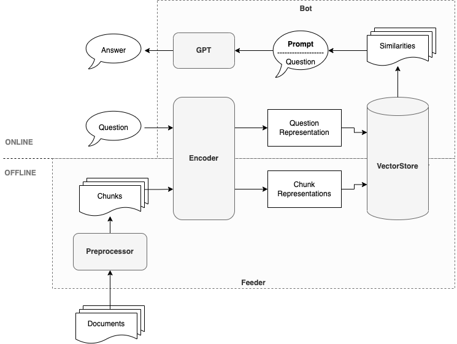

# GPTBot

[][1]

Question Answering Bot powered by [OpenAI GPT models][2].


## Installation

```bash
$ go get -u github.com/go-aie/gptbot
```


## Quick Start

```go
func main() {
    ctx := context.Background()
    apiKey := os.Getenv("OPENAI_API_KEY")
    encoder := gptbot.NewOpenAIEncoder(apiKey, "")
    store := gptbot.NewLocalVectorStore()

    // Feed documents into the vector store.
    feeder := gptbot.NewFeeder(&gptbot.FeederConfig{
        Encoder: encoder,
        Updater: store,
    })
    err := feeder.Feed(ctx, &gptbot.Document{
        ID:   "1",
        Text: "Generative Pre-trained Transformer 3 (GPT-3) is an autoregressive language model released in 2020 that uses deep learning to produce human-like text. Given an initial text as prompt, it will produce text that continues the prompt.",
    })
    if err != nil {
        fmt.Printf("err: %v", err)
        return
    }

    // Chat with the bot to get answers.
    bot := gptbot.NewBot(&gptbot.BotConfig{
        APIKey:  apiKey,
        Encoder: encoder,
        Querier: store,
    })

    question := "When was GPT-3 released?"
    answer, _, err := bot.Chat(ctx, question)
    if err != nil {
        fmt.Printf("err: %v", err)
        return
    }
    fmt.Printf("Q: %s\n", question)
    fmt.Printf("A: %s\n", answer)

    // Output:
    //
    // Q: When was GPT-3 released?
    // A: GPT-3 was released in 2020.
}
```

**NOTE**:
- The above example uses a local vector store. If you have a larger dataset, please consider using a vector search engine (e.g. [Milvus](milvus)).
- With the help of [GPTBot Server](cmd/gptbot), you can even upload documents as files and then start chatting via HTTP!


## Design

GPTBot is an implementation of the method demonstrated in [Question Answering using Embeddings][3].




## Core Concepts


| Concepts     | Description                                             | Built-in Support                                          |
|--------------|---------------------------------------------------------|-----------------------------------------------------------|
| Preprocessor | Preprocess the documents by splitting them into chunks. | ✅[customizable]<br/>[Preprocessor][4]                     |
| Encoder      | Creates an embedding vector for each chunk.             | ✅[customizable]<br/>[OpenAIEncoder][5]                    |
| VectorStore  | Stores and queries document chunk embeddings.           | ✅[customizable]<br/>[LocalVectorStore][6]<br/>[Milvus][7] |
| Feeder       | Feeds the documents into the vector store.              | /                                                         |
| Bot          | Question answering bot to chat with.                    | /                                                         |


## License

[MIT](LICENSE)


[1]: https://pkg.go.dev/github.com/go-aie/gptbot
[2]: https://platform.openai.com/docs/models
[3]: https://github.com/openai/openai-cookbook/blob/main/examples/Question_answering_using_embeddings.ipynb
[4]: https://pkg.go.dev/github.com/go-aie/gptbot#Preprocessor
[5]: https://pkg.go.dev/github.com/go-aie/gptbot#OpenAIEncoder
[6]: https://pkg.go.dev/github.com/go-aie/gptbot#LocalVectorStore
[7]: https://pkg.go.dev/github.com/go-aie/gptbot/milvus#Milvus
